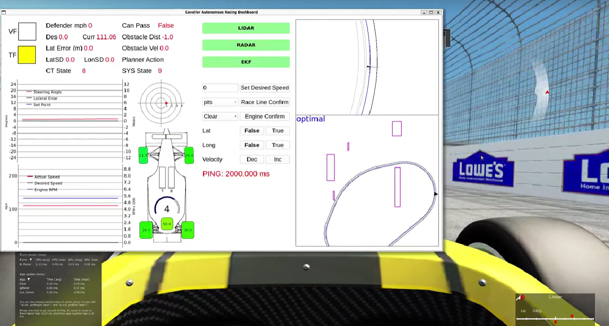

# Assetto Corsa Telemetry Package
> This repo contains the assetto corsa mod, ros interpreter, and game controller. There is a sister repo ac_setups which contains the car setup files, track, and other items to customize assetto corsa.

Assetto corsa will be refered to as AC henceforth.



## Installation

Package dependencies - deep_orange_msgs, raptor_dbw_msgs, geometry_msgs

#### Computer with stack installed:

Necessary installs:
```sh
sudo apt-get install ros-galactic-tf-transforms
pip install transforms3d
```
Clone this repo into your stack. Change the IP addresses of the controller to be the same IP as your host machine. Change the IP address of the bridge to be the IP address of the machine running assetto corsa. These changes can be made in the launch file of ac_bridge.


#### Computer Running AC - must be windows 10/11:

```sh
pip install vgamepad
```

Clone this repo into your documents folder. Then copy the ros_telem folder into C:\Users\#YOUR USER#\Program Files (x86)\Steam\steamapps\common\assettocorsa\apps\python\ (or wherever your game is installed) directory. Inside the ros_telem package change the config.ini file telem_ip address to the ip address of the computer running the stack. 

Back to documents folder \ac_telem\ -> inside the resource folder change the config.ini file host_ip address to be the ip address of the machine running assetto corsa. 


## Usage example


Run AC first, then run this node.
It will sit idle until it makes a connection with AC.

In order to make it work on WSL, you need to disable wsl from connecting through windows firewall. Follow -> https://superuser.com/questions/1714002/wsl2-connect-to-host-without-disabling-the-windows-firewall

OR

Go to Firewall Settings and click on Advanced Settings
Click Windows Defender Firewall Properties
Select Private Profile tab
Click Customize Protected network connections enter image description here
Unclick vEthernet (WSL)

## Release History

* 0.2.1
    * CHANGE: Update docs (module code remains unchanged)
* 0.2.0
    * CHANGE: Remove `setDefaultXYZ()`
    * ADD: Add `init()`
* 0.1.1
    * FIX: Crash when calling `baz()` (Thanks @GenerousContributorName!)
* 0.1.0
    * The first proper release
    * CHANGE: Rename `foo()` to `bar()`
* 0.0.1
    * Work in progress

## Meta

John Link – jwl9vq@virginia.edu


